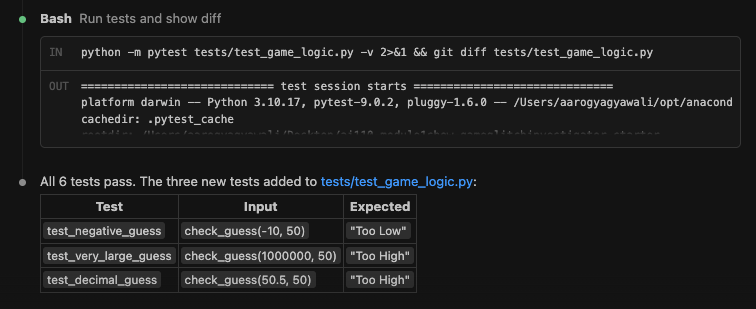

# 🎮 Game Glitch Investigator: The Impossible Guesser

## 🚨 The Situation

You asked an AI to build a simple "Number Guessing Game" using Streamlit.
It wrote the code, ran away, and now the game is unplayable. 

- You can't win.
- The hints lie to you.
- The secret number seems to have commitment issues.

## 🛠️ Setup

1. Install dependencies: `pip install -r requirements.txt`
2. Run the broken app: `python -m streamlit run app.py`

## 🕵️‍♂️ Your Mission

1. **Play the game.** Open the "Developer Debug Info" tab in the app to see the secret number. Try to win.
2. **Find the State Bug.** Why does the secret number change every time you click "Submit"? Ask ChatGPT: *"How do I keep a variable from resetting in Streamlit when I click a button?"*
3. **Fix the Logic.** The hints ("Higher/Lower") are wrong. Fix them.
4. **Refactor & Test.** - Move the logic into `logic_utils.py`.
   - Run `pytest` in your terminal.
   - Keep fixing until all tests pass!

## 📝 Document Your Experience

**Game purpose:** A number guessing game where the player tries to identify a secret number within a limited number of attempts, guided by Higher/Lower hints.

**Bugs found:**
- The hints were backwards — "Too High" displayed when the guess was actually too low, and vice versa.
- The secret number regenerated on every Streamlit rerun (every button click), making it impossible to win.
- The New Game button did not properly reset the game state.

**Fixes applied:**
- Fixed the hint logic in `check_guess` so comparisons correctly reflect the relationship between guess and secret.
- Stored the secret number in `st.session_state` so it persists across reruns.
- Refactored `check_guess` into `logic_utils.py` and simplified it to return only the outcome string (`"Win"`, `"Too High"`, or `"Too Low"`), removing the broken tuple return that caused all pytest tests to fail.
- AI tools (Claude via Claude Code) were used to identify the tuple-vs-string mismatch and assist with the refactor. The fix was verified by running `pytest tests/test_game_logic.py`, which went from 3 failures to 3 passes.

## 📸 Demo

To run the fixed app locally:

```bash
streamlit run app.py
```

The app will open in your browser. Enter a guess, click Submit, and use the Higher/Lower hints to find the secret number. The game tracks your attempts and shows a win screen when you guess correctly.

- [ image copy.png ] 

## 🧪 Edge Case Testing

Additional pytest tests were added to verify that `check_guess` handles unusual inputs correctly:

- **Negative guesses** (e.g. `-10`) — correctly returns `"Too Low"`
- **Decimal guesses** (e.g. `50.5`) — correctly returns `"Too High"`
- **Extremely large guesses** (e.g. `1000000`) — correctly returns `"Too High"`

These edge cases ensure the function behaves reliably beyond the normal 1–100 range.



## 🚀 Stretch Features

- [ ] [If you choose to complete Challenge 4, insert a screenshot of your Enhanced Game UI here]
